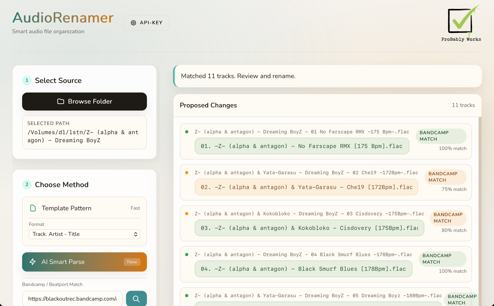

# AudioRenamer



**Smart audio file organization tool with AI-powered renaming and metadata matching.**

AudioRenamer is a cross-platform desktop application that helps you organize and rename your audio files using multiple intelligent methods: template-based patterns, Bandcamp/Beatport metadata matching, and AI-powered parsing.

## Features

### 🎯 Template Pattern Renaming
Quickly rename files using predefined patterns that extract information from existing filenames:
- `Track. Artist - Title` - Standard format with track numbers
- `Track. Title` - Simple numbered format
- Fast and reliable for consistently named files

### 🎵 Bandcamp / Beatport Match
Automatically fetch track metadata from album pages:
- Paste a Bandcamp or Beatport release URL
- Intelligent matching between local files and album tracks
- Visual confidence indicators for match quality
- Great for organizing storefront downloads

### 🤖 AI Smart Parse
Leverage Google's Gemini AI to intelligently parse messy filenames:
- Automatically extracts artist, title, and track numbers
- Handles inconsistent naming conventions
- Works with any filename format
- Requires a free Google AI API key ([get one here](https://aistudio.google.com/apikey))

### ✏️ Manual Editing
All proposed changes can be manually edited before applying:
- Review all changes before renaming
- Edit individual filenames as needed
- Color-coded confidence indicators
- Undo-friendly workflow

## Installation

### macOS
1. Download `AudioRenamer.app` from the [latest release](https://github.com/0x800700/AudioRenamer/releases)
2. Open the `.app` file
3. If macOS blocks it, go to System Preferences → Security & Privacy and allow the app

### Windows
1. Download `AudioRenamer.exe` from the [latest release](https://github.com/0x800700/AudioRenamer/releases)
2. Run the executable
3. If Windows Defender blocks it, click "More info" → "Run anyway"

### Linux
Build from source (see Development section below)

## Usage

### Basic Workflow
1. **Select Source**: Click "Browse Folder" and choose a folder containing audio files
2. **Choose Method**: Select one of the renaming methods
3. **Review Changes**: Check the proposed filenames and edit if needed
4. **Apply**: Click "Apply Rename" to rename all files

### Setting Up AI Features
To use AI Smart Parse:
1. Get a free API key from [Google AI Studio](https://aistudio.google.com/apikey)
2. Click the "API-KEY" button in the top-left corner
3. Paste your API key and save
4. The key is stored locally in your browser

**Note**: Your API key is stored only on your computer and is never sent anywhere except Google's AI service.

## Development

### Prerequisites
- Go 1.24+
- Node.js 18+
- npm
- Wails CLI: `go install github.com/wailsapp/wails/v2/cmd/wails@latest`

### Platform-Specific Requirements

**Linux (Debian/Ubuntu)**:
```bash
sudo apt install build-essential libgtk-3-dev libwebkit2gtk-4.0-dev
```

**Linux (Fedora/RHEL)**:
```bash
sudo dnf install @development-tools gtk3-devel webkit2gtk4.0-devel
```

**macOS**: Xcode Command Line Tools
**Windows**: No additional requirements

### Building

```bash
# Clone the repository
git clone https://github.com/0x800700/AudioRenamer.git
cd AudioRenamer

# Development mode
wails dev

# Build for your platform
wails build

# Build for specific platforms
wails build -platform darwin/universal  # macOS
wails build -platform windows/amd64     # Windows
wails build -platform linux/amd64       # Linux
```

## Technology Stack

- **Backend**: Go with Wails framework
- **Frontend**: Svelte with TailwindCSS
- **AI**: Google Gemini API
- **Web Scraping**: Bandcamp & Beatport metadata extraction

## License

MIT License - see LICENSE file for details

## Credits

**Good enough is good enough by ProBably Works**

---

*Developed by [ProBably Works](https://github.com/0x800700)*
